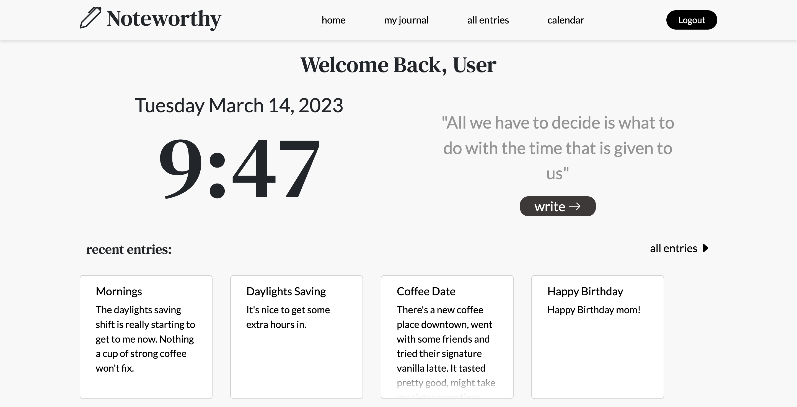

# NoteWorthy
A full CRUD Flask app that keeps track of daily journal entries. Gives users the ability to create, view, edit or tag their own entries for better organization.

## Installation
```
pipenv install
```

## Run App
```
pipenv shell
python3 server.py
```

## Demo

Login page


Dashboard page

